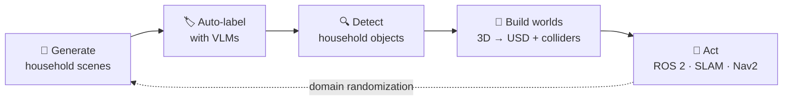

# Hi, I'm Ciuzaak 👋

> [!NOTE]
> **This profile is AI-generated.** Every time a new model comes out, I let it read my GitHub and rewrite this page.
> This version was written by **Claude Opus 5.5 in September 2026**, after going through ~60 of my public and private repositories and their recent commit history.
> Private project names, collaborators, and internal details are deliberately left out.

## What I'm building right now

Almost everything I've touched in 2026 points at one question:

**What does it take for a robot to be genuinely useful in an ordinary home?**

Working backwards from that question, my repositories have quietly turned into a pipeline:



| Stage | What that looks like in the repos |
| --- | --- |
| **Generate** | Text-to-image pipelines (Z-Image, FLUX.2, Qwen-Image) that mass-produce indoor household scenes. One YAML config per domain; quantization and acceleration benchmarks along the way. |
| **Label** | Qwen3-VL auto-labeling with crop-level verification, duplicate-box conflict cleanup, and taxonomies that grew from 87 to 400+ household classes. |
| **Detect** | LoRA fine-tuning of a 4B VLM for one-pass detection, head-to-head evaluation against YOLOv8 / YOLO-World / YOLOE, OOD generalization studies, speculative decoding, and deployment trade-offs for RK3588-class edge boards. |
| **Build worlds** | 3D-FRONT and SketchUp scenes → simulation-ready USD: shared references, voxelized wall colliders fitted by greedy box merging, multi-GPU Blender rendering, and visual QA galleries. |
| **Act** | A home-companion robot in Isaac Sim: differential drive, IMU + wheel odometry, 4× RGB-D and LiDAR, a ROS 2 Humble bridge, SLAM / Nav2, and runtime randomization of small objects. |

## The longer arc

```text
2021 ─ 2022   biomedical image segmentation — semi-supervised, continual, context priors
2023          data augmentation, diffusion models, generated training data
2024 ─ 2025   industrial vision — autofocus, procedural PBR defect synthesis, VLM retrieval, coreset selection
2026 ─ now    multimodal perception → sim-ready 3D worlds → embodied agents
```

The throughline: I keep moving one step closer to the physical world, from pixels, to labels, to scenes, to a robot that has to drive through them.

## Side quests

When something gets in my way, I usually end up building a tool for it:

| Project | What it does |
| --- | --- |
| [**LabelEditor for VS Code**](https://github.com/ciuzaak/LabelEditor-for-VSCode) | Annotate images inside VS Code: polygons, boxes, lines, points, and SAM-assisted masks. Outputs LabelMe JSON. |
| [**MiniMax H3 Bot**](https://github.com/ciuzaak/minimax-h3-bot) | A multi-GPU image-to-video service for ComfyUI, with JSONL scheduling, audio, Turbo LoRA, and a Telegram front end. |
| [**Sidebrowser**](https://github.com/ciuzaak/sidebrowser) | A side-panel Electron browser for Windows that auto-hides at the screen edge. Written entirely by Claude. |
| [**Neon Postgres Sync**](https://github.com/ciuzaak/Neon-Postgres-Sync) | Two-way sync between local files and Neon Postgres rows, with an interactive diff in VS Code. |
| [**Claude Telegram Bot**](https://github.com/ciuzaak/Claude-Telegram-Bot) | One of the early Claude bots for Telegram (2023), with 200+ stars. |
| [**docker_scripts**](https://github.com/ciuzaak/docker_scripts) · [**mihomo_scripts**](https://github.com/ciuzaak/mihomo_scripts) | Scripts for shared servers: old glibc, no TUN, and so on. |

Also in progress but not public: a Wikipedia typing-practice TUI with Cangjie hints, a closed-loop computer-use agent built on Qwen3-VL, and a subscription converter for Clash and Surge.

## Toolbox

`Python` `PyTorch` `vLLM` `Qwen3-VL` `ComfyUI` `Isaac Sim` `OpenUSD` `ROS 2` `Blender` `TypeScript` `Electron` `VS Code API` `Docker`

## Elsewhere

[🌐 ciuzaak.com](https://ciuzaak.com) · [✉️ wong@ciuzaak.com](mailto:wong@ciuzaak.com) · [📷 Instagram](https://instagram.com/ciuzaak) · [▶️ YouTube](https://www.youtube.com/@ciuzaakwong)

<sub>Generated by Claude Opus 5.5 · September 2026 · The next model will probably disagree with it.</sub>
